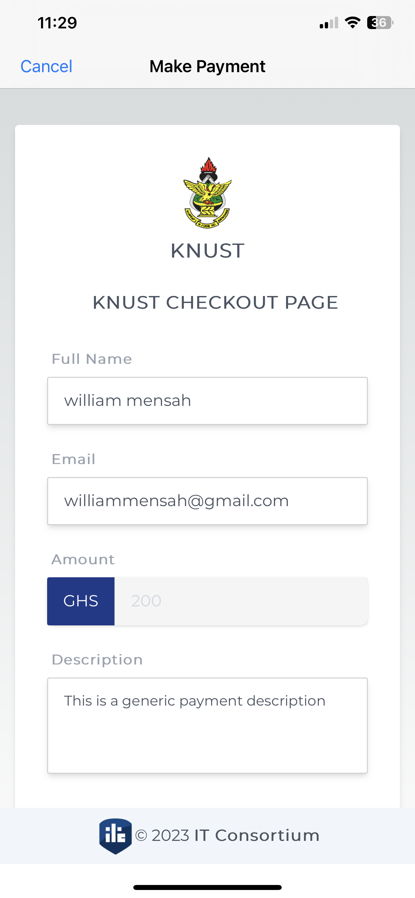
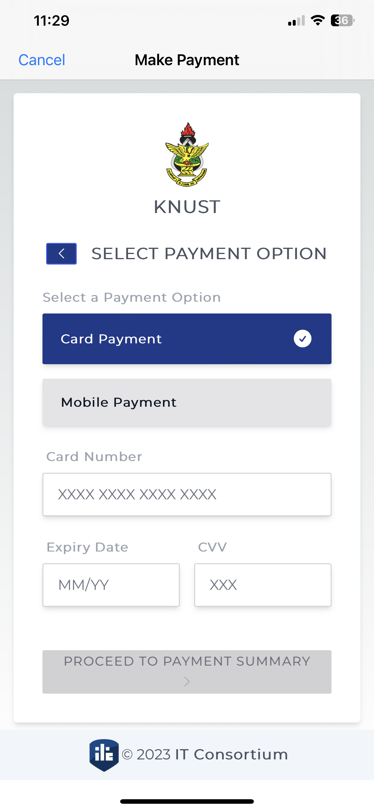

# CardPaymentSDK

A lighweight payment SDK, for credit card and mobile money payment.

## Features

- [x] Displays checkout page.
- [x] Listens to callback from checkout page.
- [x] Option to cancel payment, to dismiss payment dialog from the user.


## Screens
<div align = "center">


</div>

### SPM
If you have already Swift package set up, add `CardPaymentSDK` as a dependency to your dependencies in your `Package.swift` file.
```swift
dependencies: [
    .package(url: "https://github.com/Hackman-Adu/cardPaymentSDK.git")
]
```


## Simple example

Simply, you present `CardPaymentView` which then loads the payment checkout page. Conform your `UIViewController` to `PaymentResponseDelegate` and implement `onResponseReceived`

```swift
var payment:CardPaymentSDK = CardPaymentSDK(vc: self, paymentViewTitle: "Make Payment", paymentViewCancelText: "Cancel")
payment.delegate = self
payment.beginPayment()

```
